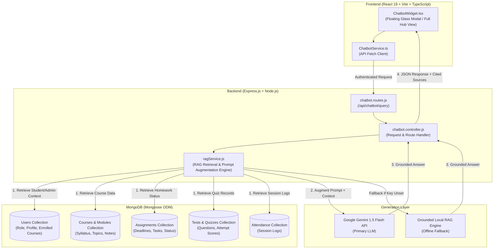

# Crismatech AI — RAG-Powered Study & Platform Assistant

An enterprise-grade, **Retrieval-Augmented Generation (RAG)** AI Study Assistant and Platform Advisor integrated into the **Student Learning Portal**.

The assistant features a modern dark glassmorphic interface, strict **Role-Based Access Control (RBAC)**, page-aware prompt suggestions, context citations, voice input/output capabilities, and a resilient dual-generation engine (Google Gemini 1.5 Flash + Grounded Fallback Engine).

---

##  Technology Stack

### Frontend Architecture
* **Core Framework**: React 19 + TypeScript + Vite 6
* **State & Routing**: React Router v7 + React Context API (`AuthContext`)
* **UI Styling**: Vanilla CSS + TailwindCSS v4 + Glassmorphism aesthetic system
* **Animations**: Framer Motion 12 (smooth spring physics, modal transitions & scale-in)
* **Iconography**: Lucide React (`MessageSquareCode`, `BrainCircuit`, `Sparkles`, `Mic`, `Volume2`, `BookOpen`)
* **Browser APIs**: Web Speech API (`SpeechRecognition` for voice input, `SpeechSynthesis` for audio read-out), Clipboard API for code copying

### Backend Architecture
* **Runtime**: Node.js (v18+) + Express.js 4
* **Database & ODM**: MongoDB + Mongoose 8 (Object Data Modeling)
* **Security & Auth**: JSON Web Tokens (JWT), Bcrypt.js, Helmet, Express Rate Limit, Mongo Sanitize
* **RAG Pipeline**: Custom Node.js retrieval engine (`ragService.js`) with MongoDB top-K document match & context augmentation
* **AI & LLM Integration**: Google Gemini 1.5 Flash REST API (`gemini-1.5-flash`) + Local Grounded RAG Fallback

---

## System Architecture



---

##  How to Use the Chatbot

### 1. Opening & Toggling the Assistant
* **Floating Launcher**: Click the glowing launcher button in the bottom-right corner of any student or admin page.
* **Keyboard Hotkey**: Press **`Alt + C`** or **`Ctrl + K`** (or `Cmd + K` on macOS) from anywhere on the platform to immediately open/close the assistant.
* **Sidebar Link**: Click **AI Assistant** in the main sidebar.

---

### . Asking Questions (Role-Aware Usage)

####  For Students
Log in with student credentials (e.g. `priya.sharma@student.com` / `Student@123`).
* **Check Enrolled Courses**: *"What courses am I currently enrolled in?"*
* **Check Pending Homework**: *"Do I have any pending assignments due soon?"*
* **Check Attendance**: *"What is my attendance percentage?"*
* **Study & Code Debugging**: *"Explain binary search in JavaScript with code examples"*
* **Quiz Prep**: *"Show my quiz scores and upcoming test details"*

####  For Admins & Instructors
Log in with admin credentials (e.g. `admin@crismatech.com` / `Admin@123`).
* **Platform User Count**: *"How many users are enrolled?"*
* **User Breakdown**: *"Show total student and instructor count"*
* **System Metrics**: *"Summarize overall course enrollments across the portal"*

---

### 3. Key Interactive Controls

| Control Feature | How to Use |
| :--- | :--- |
| **Voice Input (Speech-to-Text)** | Click the  **Microphone** icon in the input box, speak your question aloud, and the speech recognition will auto-fill your text. |
| **Voice Read-out (Text-to-Speech)** | Click the **Volume** icon in the top header to turn on audio read-out. The assistant will read out answers automatically. |
| **Workspace Hub View** | Click the ⤢ **Expand** button in the header to expand the chatbot into a full overlay view for deep study sessions and code debugging. |
| **1-Click Code Copy** | Click **Copy Code** on any code snippet box to copy code directly to your clipboard. |
| **Page-Aware Suggestions** | Click any of the dynamic prompt suggestion pills above the input field. They automatically change depending on whether you are on `/assignments`, `/courses`, `/attendance`, `/test`, or `/admin`. |
| **Context Citations** | Look at the bottom of AI messages to see cited course or assignment sources retrieved from MongoDB. |
| **Clear History** | Click the  **Trash** icon in the header to reset your conversation history. |

---

## Role-Based Access Control (RBAC) Specification

| User Role | Accessible Knowledge & Context | Restrictions |
| :--- | :--- | :--- |
| **Student** | Enrolled courses, course module topics, lecture notes, assigned homework, submission statuses, quiz attempt scores, personal attendance summary. | Blocked from platform user counts, student rosters, user emails, and admin system metrics. |
| **Instructor** | Teaching courses, course syllabi, student assignment submissions for taught courses, quiz statistics, and class attendance summaries. |  Restricted to taught course domains. |
| **Admin** | Full platform statistics (Total users, student/instructor counts, course catalog, active enrollments, system analytics). |  Unrestricted platform access. |

---

## API Endpoints Reference

### 1. Execute RAG Query
- **Endpoint**: `POST /api/chatbot/query`
- **Headers**: `Authorization: Bearer <JWT_TOKEN>`
- **Request Body**:
  ```json
  {
    "prompt": "What courses am I enrolled in?",
    "courseId": null,
    "conversationHistory": [
      { "sender": "user", "text": "Hello" },
      { "sender": "ai", "text": "Hello! How can I help you today?" }
    ]
  }
  ```
- **Response**:
  ```json
  {
    "success": true,
    "answer": "Hello Priya Sharma! Here are your active enrolled courses:\n* **Web Development Masterclass**\n* **Python for Data Science**",
    "citedSources": [
      { "type": "Course", "name": "Web Development Masterclass" }
    ],
    "ragEngine": "Google Gemini 1.5 Flash (RAG Grounded)",
    "timestamp": "2026-08-13T20:45:00.000Z"
  }
  ```

---

### 2. Get Dynamic Route Suggestions
- **Endpoint**: `GET /api/chatbot/suggestions?currentPath=/assignments`
- **Headers**: `Authorization: Bearer <JWT_TOKEN>`
- **Response**:
  ```json
  {
    "success": true,
    "suggestions": [
      "Show my pending homework assignments",
      "How do I submit an assignment upload?",
      "Explain the requirements for my latest assignment",
      "Give me debugging tips for my code submission"
    ]
  }
  ```

---

##  File Directory Structure

```
Student-Learning-Portal/
├── backend/
│   ├── modules/
│   │   └── chatbot/
│   │       ├── ragService.js           # Core RAG retrieval, prompt augmentation & LLM generation
│   │       ├── chatbot.controller.js   # API Controller for query processing & suggestions
│   │       └── chatbot.routes.js       # Express routes protected by JWT middleware
│   └── app.js                          # Express app entry registering /api/chatbot
│
├── frontend/
│   └── src/
│       └── components/
│           ├── chatbot/
│           │   ├── ChatbotWidget.tsx   # Glassmorphic UI floating widget & hub panel
│           │   └── ChatbotService.ts   # API HTTP service wrapper
│           ├── DashboardLayout.tsx     # Student layout mounting ChatbotWidget
│           ├── admin/
│           │   └── AdminLayout.tsx     # Admin layout mounting ChatbotWidget
│           └── Sidebar.tsx             # Sidebar navigation
```

---

##  Environment Configuration

Add your Google Gemini API key to `backend/.env`:

```env
# backend/.env
PORT=5000
MONGO_URI=mongodb://localhost:27017/student-learning-portal
JWT_SECRET=your_jwt_secret_here

# Optional: Google Gemini API Key for live LLM generation
GEMINI_API_KEY=AIzaSy...
```

> **Note**: If `GEMINI_API_KEY` is omitted, the assistant seamlessly uses the internal database-grounded RAG fallback engine without failing!

---

##  Getting Started

1. **Install Dependencies & Start Backend**:
   ```bash
   cd backend
   npm install
   npm run dev
   ```

2. **Start Frontend**:
   ```bash
   cd frontend
   npm install
   npm run dev
   ```

3. **Launch & Test**:
   - Open [http://localhost:3000](http://localhost:3000) in your browser.
   - Log in as a Student (`priya.sharma@student.com` / `Student@123`) or Admin (`admin@crismatech.com` / `Admin@123`).
   - Press **`Alt + C`** to start chatting with your AI Assistant!
